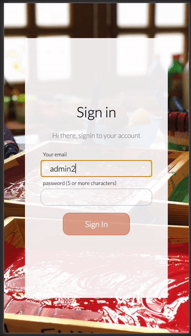

# Microverse's Final Project: My Team Builder App

[](https://app.netlify.com/sites/my-team-builder/deploys)

> This app is a catalogue manager for Job Applicantions. This Repository contains the front end applications tht works jointly with a Ruby on Rails / PostgreSQL backend located in this repo [here](https://github.com/canriquez/my-team-api)



This app is used by admins to review ACTIVE applicant's information and express its approval. It will give admins the ability to browse through the different applicants, filter applicants for the applied position, and search for specific applicants' names.

## Built With

- React.js, Redux, Webpack, Babel

- HTML5/CSS3, Javascript ES6
- JWT authentication (back end generated)
- ESlint, Stylelint
- VSCode

## Live Demo @Netlify

[Live Demo Link](https://anriquez-crypto-assets.netlify.app/)

## User Story (Demo):

### User will access the URL

- The can Signup in the app with email, name, password, password repeat.
- Since the email address us used as the ID for the user account, the signup workflow, attempts to validate the email against a API end point. If the email exists, the the App will show a little warning icon on the input field.
- Accounts can be created with the Role of Admin and User. This is only for the demo. The application currently ony shows the Admin workflow. You can still login as User, although you have no authorization for the admin views.
- If the account the account exists you can login with credentials. The app will validate the email address for in this instance.
- After Admin login, the app will display the admin index page, showing a catalog of existing applications.
- When a user selects an applicant, detailed information about the applicant is presented. (Mandatory)
  - Applicant Name
  - Picture (currently hosted in AWS S3)
  - Basic application details
  - Current admin evaluation for the applicant (if any).
- When the Admin, tap/click on an application, a more detailed page will be open with the application info.
- In the detail page, the Admin can evaluate the application as Appoved or Declined. All this actions are consumed back in the API where all records are stored for the current Admin and application.
- In the Admin index page, the main filter can be used to select and show the Approved, Declined or all applications applications.
- Since this information is stored in the back end, this approved/declined records persist per user.

## API Endpoints

The application uses JWT authentications, to handle any request after successful login. Each token has a 4 expiration time and after that, the used is prompted to log back again on any new request to the backend.

### Below is a list of the API end points used by this application.

| Endpoint                       | Functionality                                 | Authentication | Authorization :role | Details                          |
| ------------------------------ | --------------------------------------------- | -------------- | ------------------- | -------------------------------- |
| POST /signup                   | User Signup                                   | NA             | NA                  |                                  |
| POST /auth/login               | User Login                                    | NA             | NA                  |                                  |
|                                | Logout                                        |                |                     | Just kill browser token          |
| GET /users/:id                 | Get User Information                          | token          | :user               | :admin                           | profile page |
| PUT /users/:id                 | Update user profile information               | token          | :user               | :admin                           | profile page |
|                                |                                               |                |                     |                                  |
| GET /applications              | get all applications                          | token          | :admin              |                                  |
| GET /applications/:id          | get detailed application info                 | token          | :admin              | :user                            | It refers to applicant information details |
|                                |                                               |                |                     |                                  |
| POST /applications/:id/likes   | Create a new like / dislike for application   | token          | :admin              |                                  |
| PUT /applications/:id/likes    | Update a like/dislike                         | token          | :admin              |                                  |
| DELETE /applications/:id/likes | delete a like/dislike                         | token          | :admin              |                                  |
|                                |                                               |                |                     |                                  |
| GET /adhome                    | get all application information for home page | token          | :admin              | Custome made query 2ms execution |
|                                |                                               |                |                     |                                  |
|                                |                                               |                |                     |                                  |
| POST /applications             | Create a new application                      | token          | :user & author      | only :user and author            |
| PUT /applications/id           | Update an application                         |                | :user & author      | only :user and author            |
| DELETE /applications/:id/likes | Delete application                            |                | :user & :admin      | only :user, author and :admin    |
|                                |                                               |                |                     |                                  |
| POST /jobposts                 | Create a new application                      |                | :admin              |                                  |
| PUT /jobposts/id               | Update an application                         |                | :admin & author     | only :admin and author           |
| DELETE /jobposts/:id/likes     | Delete application                            |                | :admin & author     | only :admin and author           |

## Front end design inspiration

The application front end is inspired in the work of [Alexey Savitskiy on Behance](https://www.behance.net/alexey_savitskiy)

## Getting Started

This project was bootstrapped with [Create React App](https://github.com/facebook/create-react-app).

To get a local copy up and running follow these simple example steps.

### Prerequisites

- To install the app in your system, make sure you have node/npm installed. [get npm](https://www.npmjs.com/get-npm)

### Setup

- Clone the repository in your system by using:

`git clone `

## Install

- Next step is to CD into the local repository and run:

`npm install`

### start development mode in your local environment

`npm start`

Runs the app in the development mode.<br />
Open [http://localhost:3000](http://localhost:3000) to view it in the browser.

The page will reload if you make edits.<br />
You will also see any lint errors in the console.

### `npm build`

This command builds the app for production to the `build` folder.<br />
It correctly bundles React in production mode and optimizes the build for the best performance.

The build is minified and the filenames include the hashes.<br />
Your app is ready to be deployed!

See the section about [deployment](https://facebook.github.io/create-react-app/docs/deployment) for more information.

### Run tests

- Run the test suite app for store actions with
  ```
  $ npm test
  ```

## Authors

👤 **_Carlos Anriquez_**

- Github: [@canriquez](https://github.com/canriquez)
- Twitter: [@cranriquez](https://twitter.com/cranriquez)
- Linkedin: [linkedin](https://www.linkedin.com/in/carlosanriquez/)
- Portfolio: [carlosanriquez.com](https://www.carlosanriquez.com)

## 🤝 Contributing

Contributions, issues, and feature requests are welcome!

Feel free to check the [issues page](issues/).

## Show your support

Give a ⭐️ if you like this project!

## Acknowledgments

My family
The Beagles @microverseinc

## 📝 License
